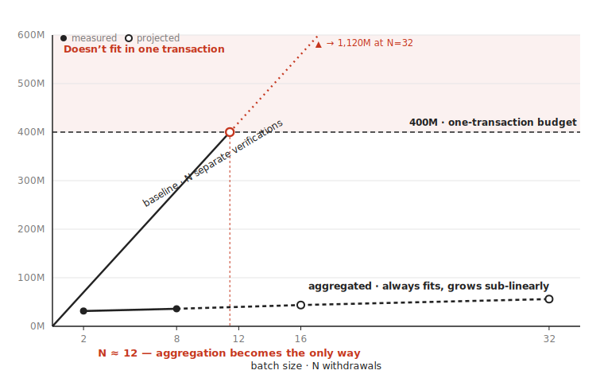
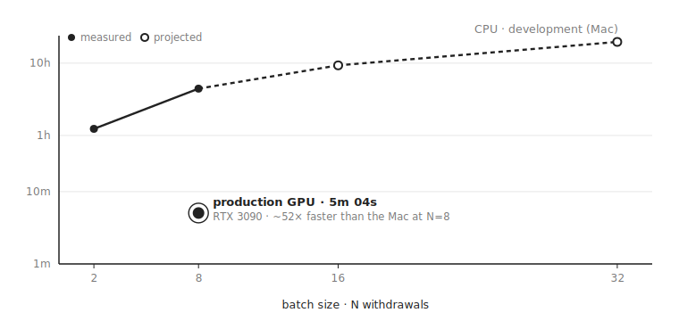

# Confidential Payments Rollup on Stellar

Aggregates N private pool withdrawals off-chain into one RISC Zero receipt (Groth16/BN254) and verifies it on-chain in one Soroban transaction.

**"Confidential"** means counterparties are unlinkable (deposit↔withdrawal link is broken via anonymity set). **Amounts are in the clear** — they appear in the journal. Never claim hidden amounts.

Hackathon: Stellar Hacks: Real-World ZK · target 1st place ($5,000) · deadline 2026-07-29.

---

## Docker Required (STARK→Groth16 wrap on ARM)

> **This is mandatory for real proofs. Without Docker the receipt cannot be
> verified on-chain, which violates the hackathon "ZK load-bearing" rule.**

The RISC Zero SDK generates a STARK receipt natively. To submit it to the
on-chain Soroban verifier it must be wrapped to **Groth16/BN254** — this wrap
runs inside the `risc0/groth16-prover` Docker image.

On Apple Silicon (ARM) the Docker image handles the x86 proving requirement.
On x86 Linux Docker is still needed for the wrap step.

**Install Docker Desktop:** https://www.docker.com/products/docker-desktop/

**Verify Docker is running before any proving:**

```bash
docker info
```

---

## Quick Start

### Prerequisites

```bash
# 1. Rust stable toolchain (managed by rust-toolchain.toml)
rustup show

# 2. RISC Zero toolchain (rzup)
curl -L https://risczero.com/install | bash
rzup install

# 3. Docker Desktop running (for Groth16 wrap)
docker info

# 4. Stellar CLI
curl -fsSL https://github.com/stellar/stellar-cli/raw/main/install.sh | sh
```

### Build

```bash
cargo build --workspace
```

### Test

```bash
cargo test --workspace
```

### Prove (requires Docker + golden inputs from s1/02)

```bash
make prove
```

### Demo dry-run against testnet

```bash
# First generate a receipt:
make prove
# Then dry-run the on-chain settle:
make demo-dryrun
```

---

## Workspace Layout

```
Cargo.toml              # workspace root; risc0-zkvm pinned to =3.0.5
rust-toolchain.toml     # stable channel + wasm32v1-none target
Makefile                # prove / bench / demo-dryrun (fail-loud prereq checks)
crates/
  zk-core/              # no_std: Poseidon2-BN254, Merkle, commitment, nullifier, journal codec
methods/
  guest/                # RISC Zero guest (re-executes rollup validity natively)
host/                   # host binary: runs guest + Groth16 wrap
contracts/
  rollup/               # Soroban rollup contract: settle_batch()
golden/                 # frozen PoC vectors (cross-check) + demo inputs
bench/                  # two-axis benchmark (s3/01)
```

---

## Architecture

```
         Off-chain                         On-chain (Stellar)
┌─────────────────────────┐            ┌──────────────────────────┐
│  N notes (private)      │            │  RollupContract          │
│  Merkle paths           │            │  settle_batch(           │
│         │               │            │    seal,                 │
│         ▼               │            │    image_id,             │
│  RISC Zero guest        │            │    journal               │
│  (re-executes validity  │            │  )                       │
│   in Rust natively)     │            │                          │
│         │               │            │  1. verify receipt ✓     │
│         ▼               │            │  2. root ∈ known_roots ✓ │
│  RISC Zero STARK        │            │  3. N× assert !spent ✓   │
│         │               │            │     mark_spent           │
│         ▼  Docker wrap  │            │  4. N× transfer ✓        │
│  Groth16/BN254 receipt  │──────────► │                          │
│  (1 proof; sub-linear   │            │  ~35.3M instr (~8.8%     │
│   cost, far below cap)  │            │   of 400M budget)        │
└─────────────────────────┘            └──────────────────────────┘
```

Key properties:
- **On-chain cost grows sub-linearly in N** (one ~constant Groth16 verification + N small transfers; ~31.5M→56.1M from N=2→32 — far slower than the budget, see Benchmark below)
- **No SNARKs inside the guest** (zero pairings inside zkVM — pure native Rust)
- **Atomic batch** (all-or-nothing: one spent nullifier reverts all payouts)

---

## Benchmark — two axes

<!-- BENCH:START (generated by `cd frontend && npm run bench:export` — do not edit by hand) -->

> Aggregated, the on-chain cost grows sub-linearly with N — from ~7.9% of a block's budget at N=2 to ~14% at N=32 — staying well inside the 400M limit. Settling the same withdrawals as N separate verifications grows linearly and stops fitting in a single transaction around N=12.



**The differentiator in one image:** settling N withdrawals as N separate Groth16 verifications crosses the 400M single-transaction budget around **N ≈ 12** and stops being possible at all. Aggregated into one receipt, the on-chain cost grows sub-linearly (it is **not** flat) and always fits.

| N | depth | cycles (measured) | proving · CPU (dev) | proving · GPU (prod) | settle (aggregated) | baseline · N×35M |
|---|---|---|---|---|---|---|
| 2 | 3 | 30,670,848 | 1h 14m (**measured**) | — | 31.5M (7.9%, **measured**) | 70M (fits) |
| 8 | 3 | 122,683,392 | 4h 26m (**measured**) | 5m 04s (**measured**) | 36.1M (9.0%, **measured**) | 280M (fits) |
| 16 | 4 | 263,192,576 | 9h 19m (projected) | — | 43.8M (10.9%, projected) | 560M (**won’t fit**) |
| 32 | 5 | 561,512,448 | 19h 40m (projected) | — | 56.1M (14.0%, projected) | 1120M (**won’t fit**) |

Off-chain, proving grows with N — but in production it is **minutes, not hours**: a real N=8 proof on a single RTX 3090 (native CUDA) took **5m 04s**, ~52× faster than the Mac development figure of 4h 26m. The Mac hours are an x86-on-ARM emulation artifact, not the production number.



Every cell is **measured** or projected — never mixed without a label (full provenance and method in [docs/proving-times.md](docs/proving-times.md)). A live, interactive version is at **/benchmarks** in the app.

<!-- BENCH:END -->

---

## Version Pins

| Component | Version | Notes |
|-----------|---------|-------|
| `risc0-zkvm` | `=3.0.5` | 3.0.0 is yanked; 3.0.5 is the earliest installable 3.x patch |
| `risc0-build` | `=3.0.5` | matches zkvm |
| `risc0-ethereum-contracts` | `=3.0.1` | for `encode_seal()` |
| Groth16 parameters | `3.0.0` | from `stellar-risc0-verifier/contracts/groth16-verifier/parameters.json` |
| `soroban-sdk` | `25.1.0` | matches stellar-risc0-verifier |

> **Note:** `risc0-zkvm =3.0.0` is listed in `CONTEXT.md` as the target, but that
> exact version is **yanked** on crates.io (confirmed 2026-06-20). The
> Groth16/BN254 verification keys are identical across all 3.0.x patch versions.
> We pin to `=3.0.5` which is compatible with the deployed verifier.

---

## Privacy Model

This system provides **counterparty unlinkability**: the on-chain link between a
deposit and a withdrawal is broken via the anonymity set (Merkle tree of
commitments). **Amounts are always visible in the journal.**

The `settle_batch` journal contains:
```
{ merkle_root, [nullifier_1, ..., nullifier_N], [(recipient_1, amount_1), ..., (recipient_N, amount_N)] }
```

Trust boundary: the sequencer (single-operator MVP) sees the note→recipient
mapping off-chain. Unlinkability is on-chain/public, not vs. the sequencer.

---

## Deployed Verifier (Stellar Testnet)

From `stellar-risc0-verifier/`:
- On-chain tx: `652e1b7f…`
- Verifier contract: `CBQF…`
- Parameters version: `3.0.0` (Groth16/BN254, compatible with 3.0.x receipts)
